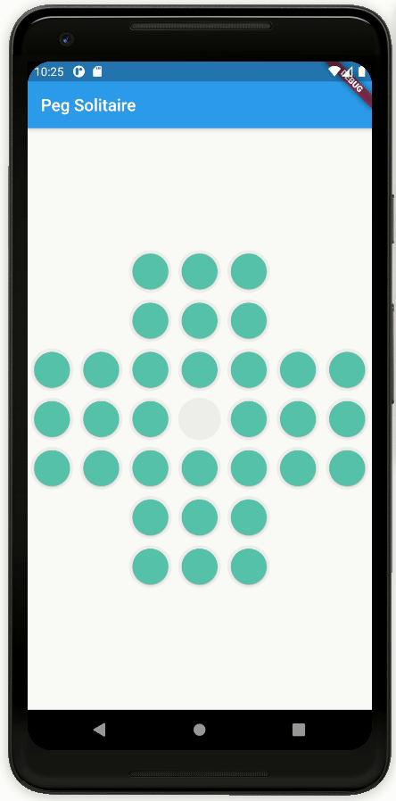

# peg solitaire

Peg solitaire (or Solo Noble) is a board game for one player involving movement of pegs
on a board with holes. Some sets use marbles in a board with indentations.
[Read more ...](https://en.wikipedia.org/wiki/Peg_solitaire)

This is my first personal project using Flutter and I am still learning dart 
and the flutter framework. Expect multiple revisions and complete overhauls as
I learn new data structures and framework components.

# demo

